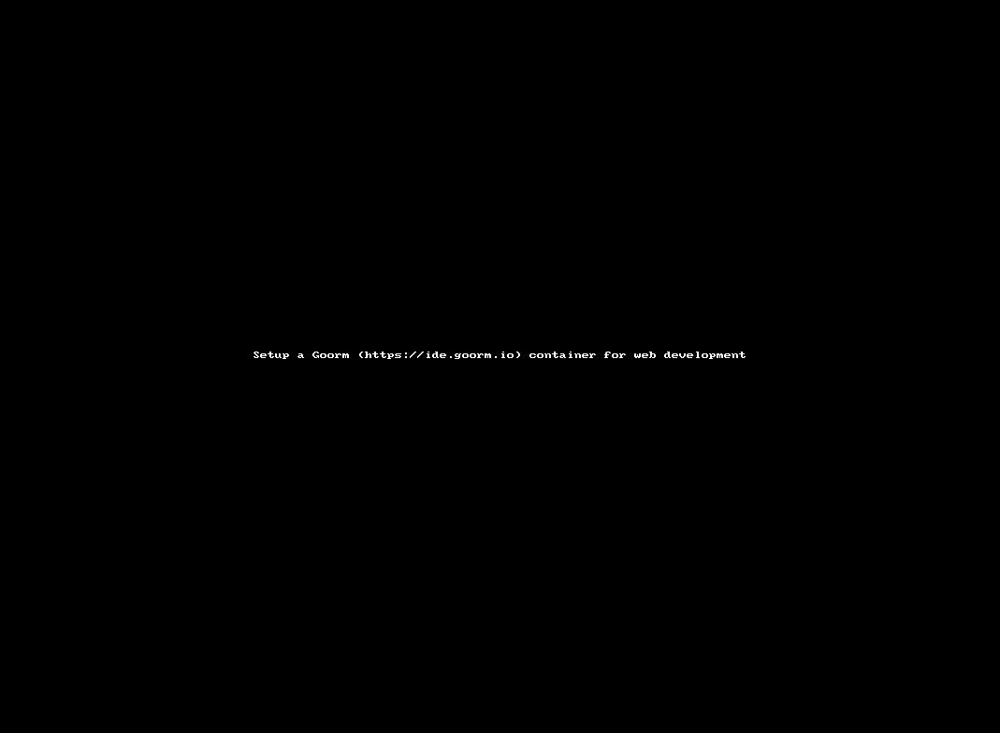

## Τεχνολογίες Διαδικτύου - εργαστήριο #1

### Περιβάλλον εργασίας

Σκοπός του πρώτου εργαστηρίου είναι η εγκατάσταση ενός περιβάλλοντος εργασίας το οποίο θα επιτρέπει την συγγραφή κώδικα και την προβολή του μέσω του Διαδικτύου από ένα public και live url.

Για το σκοπό αυτό, ως μια εύχρηστη λύση, προτείνεται να κάνετε δωρεάν εγγραφή στο https://ide.goorm.io .
Στη δωρεάν έκδοση το goorm IDE σας παρέχει τη δυνατότητα να στήσετε έως 5 ανεξάρτητους private containers, διαλέγοντας από ποικίλα έτοιμα stacks λογισμικού. Για το μάθημα αυτό θα αξιοποιήσουμε ένα `php` based stack.

Μετά την εγγραφή σας στο ide.goorm.io ακολουθήστε τις πιο κάτω οδηγίες για να δημιουργήσετε ένα container με τα εξής χαρακτηριστικά:
* Name: `My_web_container`
* Region: `Frankfurt` για σχετικά χαμηλό latency σε σχέση με πιο απομακρυσμένους.
* **Visibility**: `Private`
* Template: `Default Template`
* Deployment: `Not used`
* **Stack**: `PHP`
    * Template & OS τα αφήνετε ως έχουν
* Additional module/package:
    * [X] Install MySQL
    * [X] Enable mysql-ctl command
    * [ ] Install MongoDB




### Δημιουργία HTML κώδικα

Ο container που δημιουργήσατε περιέχει ένα `index.php` αρχείο. Σβύστε το, με php θα δουλέψουμε σε επόμενη εβδομάδα.

Δημιουργήστε ένα νέο αρχείο `index.html` με περιεχόμενο:
```
<html>
<head>
	<title>Hello goorm</title>
</head>
<body>
	<h1>Hello goorm</h1>
	<p>
        This is my first html file!
    </p>
</body>
</html>
```

### Serving HTML κώδικα

Για να έχετε πρόσβαση μέσω ενός web browser στις ιστοσελίδες που δημιουργείτε εκτελέστε είτε από το UI του Goorm την επιλογή `new run php` (_ναι, php παρότι δουλεύουμε σε html_) ή από το terminal εκτελείτε `php -S 0.0.0.0:80 -t /workspace/My_web_container` (_εφόσον ονομάσατε `My_web_container`_ τον container σας). Το περιεχόμενό σας είνια διαθέσιμο στο URL που βρίσκεται στο μενού `PROJECT` `>` `Running URL and Port`.


### Microtasks εργαστηρίου

Δημιουργήστε, με κώδικα html, σελίδες που παράγουν το ακόλουθο οπτικό αποτέλεσμα με χρήση των html tags που προτείνονται):

| Microtask | Προτεινόμενα HTML Tags |
|-----------|------------------------|
| [απλή σελίδα](./microtasks/01_simple_html.png) | `html, head, title, body, p` |
| [μορφοποίηση κειμένου](./microtasks/02_text_formatting.png) | `html, body, p, strong, sub, u, br, hr, del`
| [μορφοποίηση επικεφαλίδων](./microtasks/03_text_headings.png) | `html, body, h1, h2, h3, h4, h5, h6` και αναζητήστε το attribute `align` που μπορεί να λάβει ένα `h` tag
| [απλή λίστα](./microtasks/04_unordered_lists.png) | `html, body, ul, li`
| [ταξινομημένη λίστα](./microtasks/05_ordered_lists.png) | `html, body, ol, li`
| [λίστα ορισμών](./microtasks/06_definition_lists.png) | `html, body, dl, dd, dt`
| [εμφωλευμένες λίστες](./microtasks/07_nested_lists.png) | `html, body, ul, li`
| [σύνδεσμοι](./microtasks/08_linking.png) | `html, body, h2, a`
| [εικόνες](./microtasks/09_images.png) | `html, body, img`
| [απλός πίνακας](./microtasks/10_simple_tables.png) | `html, body, caption, table, tr, th, td, h1`
| [σύνθετος πίκανας](./microtasks/11_complex_table.png) | `html, body, caption, table, tr, th, td, h1`
| [πιο σύνθετος πίκανας](./microtasks/12_complex_table_2.png) | `html, body, caption, table, tr, th, td, h1`
| [div](./microtasks/13_div.png) | `html, body, div, h4, p`
| [απλή φόρμα](./microtasks/14_simple_form.png) | `html, body, form, input`
| [φόρμα με πεδίο κειμένου](./microtasks/15_simple_form_2.png) | `html, body, form, input, textarea`
| [φόρμα με κλειστές επιλογές](./microtasks/16_simple_form_3.png) | `html, body, form, input, option, select, br`


### Task εβδομάδας

Δημιουργήστε το βιογραφικό σας με έκδοση html και με όνομα αρχείου cv.html, αξιοποιώντας διάφορα επίπεδα heading, παραγράφους, λίστες (αριθμημένες και μη), συνδέσμους και μία τουλάχιστον εικόνα (_μη χρησιμοποιήσετε την πραγματική φώτο σας_). Εκτελέστε τον εξυπηρετητή ιστοσελίδων (εντολή php πιο πάνω) και προσπελάστε το βιογραφικό σας από ένα άλλο γειτονικό υπολογιστή και το κινητό σας τηλέφωνο.

**_Help:_** https://repository.kallipos.gr/handle/11419/1773?&locale=el
