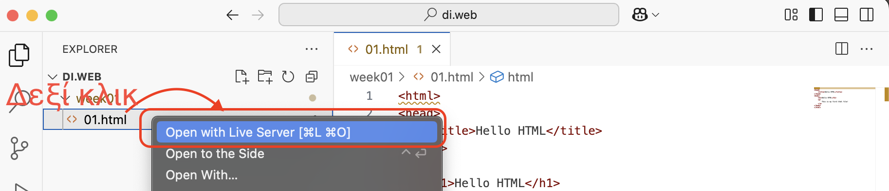
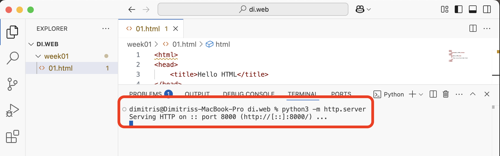

## Τεχνολογίες Διαδικτύου - εργαστήριο #1

### Περιβάλλον εργασίας

Σκοπός του πρώτου εργαστηρίου είναι η εγκατάσταση ενός βασικού περιβάλλοντος εργασίας και η εξοικείωση με αυτό, ώστε να μπορείτε να γράφετε κώδικα και να τον προσπελαύνετε μέσω ενός browser.

Για το σκοπό αυτό, ως μια εύχρηστη λύση, προτείνεται να χρησιμοποιήσετε το προγραμματιστικό περιβάλλον VSCode και τα extensions `Live server` και `HTMLHint`.  
Αργότερα θα κάνουμε χρήση php και mysql, είτε απ' ευθείας στο μηχάνημά σας ή μέσω docker. 

 

### Δημιουργία HTML κώδικα

Δημιουργήστε το πρώτο `html` αρχείο σας.  
Δημιουργήστε ένα φάκελο στον οποίο θα δουλέυετε όλο τον κώδικα του εργαστηρίου, σε ένα υποφάκελο κάθε εβδομάδα. 

Δημιουργήστε ένα νέο αρχείο `week01/index.html` με περιεχόμενο:
```
<html>
<head>
	<title>Hello goorm</title>
</head>
<body>
	<h1>Hello goorm</h1>
	<p>
        This is my first html file!
    </p>
</body>
</html>
```

### Serving HTML κώδικα

Για να έχετε πρόσβαση μέσω ενός web browser στις ιστοσελίδες που δημιουργείτε εκτελέστε από το VSCode `Δεξί κλικ`+`Open with Live server`.  
 

Εναλλακτικά, αν στο σύστημά σας υπάρχει εγκατεστημένη python3 μπορείτε να τρέξετε ένα τοπικό http server, με την εντολή `python3 -m http.server` (εκτελεσμένη στο φάκελο που βρίσκονται και τα html αρχεία σας) και να δείτε τις σελίδες σας στο `localhost` (και το port που έχει ξεκινήσει ο http server).
 


### Microtasks εργαστηρίου

Δημιουργήστε, με κώδικα html, σελίδες που παράγουν το ακόλουθο οπτικό αποτέλεσμα με χρήση των html tags που προτείνονται:

1. [απλή σελίδα](./microtasks/01_simple_html.png)  
  `html, head, title, body, p`
0. [μορφοποίηση κειμένου](./microtasks/02_text_formatting.png)  
  `html, body, p, strong, sub, sup, u, br, hr, del`
0. [μορφοποίηση επικεφαλίδων](./microtasks/03_text_headings.png)  
  `html, body, h1, h2, h3, h4, h5, h6`

    <details>
      <summary>help..</summary>
      <i>αναζητήστε το attribute <code>align</code> που μπορεί να λάβει ένα <code>h</code> tag</i>
    </details>

4. [απλή λίστα](./microtasks/04_unordered_lists.png)    
  `html, body, ul, li`

    <details>
    <summary>help..</summary>
    <i>αναζητήστε το attribute <code>type</code> που μπορεί να λάβει ένα <code>li</code> tag και το οποίο δέχεται τιμες <code>1|a|A|i|I|disc|circle|square</code></i>
    </details>

5. [ταξινομημένη λίστα](./microtasks/05_ordered_lists.png)  
  `html, body, ol, li`
0. [λίστα ορισμών](./microtasks/06_definition_lists.png)  
  `html, body, dl, dd, dt`
0. [εμφωλευμένες λίστες](./microtasks/07_nested_lists.png)  
  `html, body, ul, li`
0. [σύνδεσμοι](./microtasks/08_linking.png)  
  `html, body, h2, a`

    <details>
    <summary>help..</summary>
    <i>αναζητήστε το attribute <code>href</code> που μπορεί να λάβει ένα <code>a</code> tag
    </details>

9. [εικόνες](./microtasks/09_images.png)  
  `html, body, img`  

    <details>
    <summary>help..</summary>
    <i>αναζητήστε τα attributes <code>src, width, height</code> που μπορεί να λάβει ένα <code>img</code> tag
    </details>

10. [απλός πίνακας](./microtasks/10_simple_tables.png)  
  `html, body, h1, caption, table, tr, th, td`
0. [σύνθετος πίκανας](./microtasks/11_complex_table.png)  
  `html, body, h1, caption, table, tr, th, td`

    <details>
    <summary>help..</summary>
    <i>αναζητήστε τα attributes <code>colspan, rowspan</code> που μπορεί να λάβει ένα <code>th ή td</code> tag
    </details>

12. [πιο σύνθετος πίκανας](./microtasks/12_complex_table_2.png)   
  `html, body, caption, table, tr, th, td, h1`
0. [απλή φόρμα](./microtasks/14_simple_form.png)  
  `html, body, form, input`

    <details>
    <summary>help..</summary>
    <i>αναζητήστε τα attributes <code>name, type, value</code> που μπορεί να λάβει ένα <code>input</code> tag
    </details>

14. [φόρμα με πεδίο κειμένου](./microtasks/15_simple_form_2.png)  
  `html, body, form, input, textarea`
0. [φόρμα με κλειστές επιλογές](./microtasks/16_simple_form_3.png)  
  `html, body, form, input, select, option`

### Task εβδομάδας

Δημιουργήστε το βιογραφικό σας με έκδοση html και με όνομα αρχείου cv.html, αξιοποιώντας διάφορα επίπεδα heading, παραγράφους, λίστες (αριθμημένες και μη), συνδέσμους και μία τουλάχιστον εικόνα (_μη χρησιμοποιήσετε την πραγματική φώτο σας_). Εκτελέστε τον εξυπηρετητή ιστοσελίδων (εντολή php πιο πάνω) και προσπελάστε το βιογραφικό σας από ένα άλλο γειτονικό υπολογιστή και το κινητό σας τηλέφωνο.

**_Help:_**
* Εργαστηριακές ασκήσεις δικτύων Η/Υ, **Εισαγωγή στην HTML**, Κωνσταντίνος Χειλάς, Αλέξανδρος Βακαλούδης, Αναστάσιος Πολίτης  
  https://repository.kallipos.gr/handle/11419/1773?&locale=el
* HTML basics από από Mozilla MDN  
  https://developer.mozilla.org/en-US/docs/Learn/Getting_started_with_the_web/HTML_basics
* HTML Cheatsheet από stanford.edu
 https://web.stanford.edu/group/csp/cs21/htmlcheatsheet.pdf
