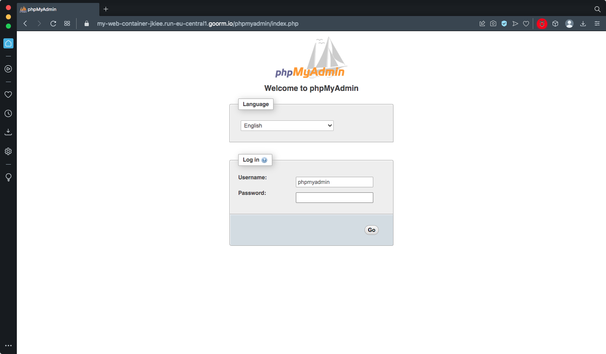

## Τεχνολογίες Διαδικτύου - εργαστήριο #6

### PHP & MySQL

Σκοπός του έκτου εργαστηρίου είναι η αξιοποίηση server-side προγραμματισμού σε γλώσσα PHP και η σύνδεση με μια σχεσιακή βάση δεδομένων MySQL.  

#### Εγκατάσταση phpmyadmin

Ο container που χρησιμοποιείτε έχει ήδη εγκαταστημένο MySQL server από τις επιλογές που έγιναν κατά τη δημιουργία του. Το περιβάλλον phpmyadmin θα παρέχει ένα web-based περιβάλλον για την εύκολη αλληλεπίδραση με το server για τη δημιουργία των πινάκων, αλλά και για την δοκιμαστική εκτέλεση queries.

Στο terminal του goorm ide εκτελέστε:  
**Όταν ερωτηθείτε για phpmyadmin password, δώστε ένα που θα θυμάστε!!**
```
apt-get update
apt-get install -y mysql-server
service mysql start
apt-get install -y php7.3-mbstring php7.3-mysqli phpmyadmin
service apache2 restart
```
Η πρόσβαση στο phpmyadmin περιβάλλον γίνεται από `PROJECT` -> `Running URL & port` και στη συνέχεια στο browser επικολλάτε στο url το επίθεμα `/phpmyadmin/`.   

Username: `phpmyadmin`  
Password: _ό,τι δώσατε νωρίτερα στην εγκατάσταση_



Πηγή: https://help.goorm.io/en/goormide/18.faq/language-and-environment/how-to-install-phpmyadmin

#### Παροχή δικαιωμάτων δημιουργίας και διαχείρισης βάσεων στο χρήστη phpmyadmin

Ο χρήστης `phpmyadmin` δεν έχει δικαιώματα δημιουργίας νέας βάσης δεδομένων (την οποία θα χρειαστείτε). Από το terminal του goorm ide, εκτελέστε:
```
GRANT ALL PRIVILEGES ON *.* TO 'phpmyadmin'@'localhost';
FLUSH PRIVILEGES;
```
Συνδεθείτε ως χρήστηςη `phpmyadmin` στο περιβάλλον `https://[_your_project_url_]/phpmyadmin/` με πλήρη πλέον δικαιώματα.

##### _Hint: πώς εκτελούμε mysql και php κώδικα;_

Σε αυτό το σημείο (με τις πιο πάνω εντολές) τόσο η mysql όσο και ο web server (apache/php) εκτελούνται. Όταν ξανασυνδεθείτε στον container σας για να ξεκινήσετε πάλι τη βάση δεδομένων και τον web εξυπηρετητή, εκτελείτε στο terminal:
```
service mysql start
service apache2 start
```
_**Προσέξτε** μην εκτελείτε `new run php` από το web ui του goorm IDE γιατί έτσι δε θα ξεκινά το εργαλείο διαχείρισης της βάσης phpmyadmin. Προτιμήστε τις πιο πάνω εντολές._

### Microtasks εργαστηρίου

1. Δημιουργήστε μια νέα βάση δεδομένων στη MySQL η οποία να περιέχει δύο πίνακες:
    * ένα πίνακα με πεδία `username` και `password`
    * ένα πίνακα με πεδία `person` και `quote`


2. Δημιουργήστε μία σελίδα `index.php` η οποία:
    + εμφανίζει μία login form, η οποία κάνει `POST` στον εαυτό της
    + όταν ο χρήστης υποβάλει τη φόρμα, ελέγχονται τα στοιχεία στη βάση δεδομένων
        + αν τα στοιχεία δεν υπάρχουν στη βάση, εμφανίζεται πάλι η login form
        + αν τα στοιχεία επιβεβαιώνονται στη βάση, τίθεται μια session μεταβλητή (πχ `logged_in_user`) και ο χρήστης ανακατευθείται στη σελίδα `quotes.php`


3. Δημιουργήστε τη σελίδα `quotes.php` η οποία:
    + πριν εμφανίζει οποιοδήποτε html περιεχόμενο ελέγχει αν ο χρήστης έχει ήδη κάνει login αναζητώντας τη session μεταβλητή `logged_in_user`
        + αν δεν βρεθεί η session μεταβλητή ο χρήστης ανακατευθείνεται στη σελίδα της login form
        + αν βρεθεί η session μεταβλητή, η σελίδα `quotes.php` εμφανίζει μία τυχαία quote από όσες είναι αποθηκευμένες στη βάση
    + παρέχει δύο html elements της επιλογής σας (πχ κουμπιά, ή links)
        + το πρώτο ξαναφορτώνει τη σελίδα `quotes.php` για να εμφανιστεί μια επόμενη quote
        + το δεύτερο οδηγεί σε σελίδα `logoff.php` η οποία κάνει log off το χρήστη (διαγράφει τη μεταβλητή `logged_in_user`) και ανακατευθύνει στη σελίδα της login form


4. Μεταφέρετε τον κώδικα διαχείρισης του ελέγχου πρόσβασης σε αρχείο `functions.php` το οποίο κάνετε εισαγωγή στις σελίδες που τον χρειάζονται και εκεί να τον καλείτε.
